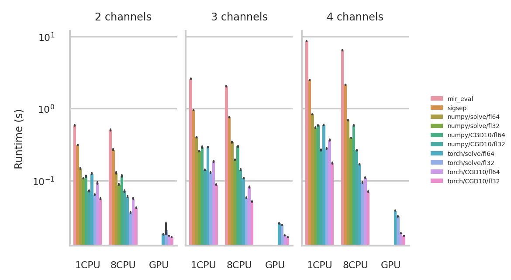
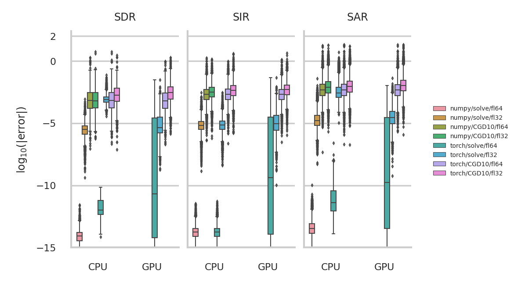

SDR &mdash; Medium Rare with Fast Computations
===============================================

This repository contains the code to reproduce some of the experiments of
in the paper [SDR &mdash; Medium Rare with Fast Computation](https://arxiv.org/abs/2110.06440).
This is essentially a benchmark of the
[fast\_bss\_eval](https://github.com/fakufaku/fast_bss_eval) Python package for
the evaluation of blind source separation algorithms.

**Abstract** &mdash; We revisit the widely used bss eval metrics for source
separation with an eye out for performance. We propose a fast algorithm fixing
shortcomings of publicly available implementations. First, we show that the
metrics are fully specified by the squared cosine of just two angles between
estimate and reference subspaces. Second, large linear systems are involved.
However, they are structured, and we apply a fast iterative method based on
conjugate gradient descent. The complexity of this step is thus reduced by a
factor quadratic in the distortion filter size used in bss eval, usually 512.
In experiments, we assess speed and numerical accuracy. Not only is the loss of
accuracy due to the approximate solver acceptable for most applications, but
the speed-up is up to two orders of magnitude in some, not so extreme, cases.
We confirm that our implementation can train neural networks, and find that
longer distortion filters may be beneficial.

Author
------

[Robin Scheibler](mailto:robin[dot]scheibler[at]linecorp.com)

Quick Start
-----------

### Get the Code

```bash
git clone https://github.com/fakufaku/sdr_medium_rare.git
```

### Install Dataset

We use the [wsj1_2345_db](https://github.com/fakufaku/create_wsj1_2345_db) dataset for the experiments.
To create the dataset, follow the instructions given in the dataset repository and use the `config_dataset_wsj1_2345_db.json` file.

```bash
git clone https://github.com/fakufaku/create_wsj1_2345_db.git
cd create_wsj1_2345_db
python ./make_dataset.py <some_path>/sdr_medium_rare/config_dataset_wsj1_2345_db.json <path_to_original_datasets> <path_to_output>
```
Then, create a symbolic link in the `sdr_medium_rare` folder.
```bash
cd <some_path>/sdr_medium_rare
ln -s <path_to_output>/wsj1_2345_db wsj1_2345_db
```

### Run Experiments

Assuming use of [anaconda](https://www.anaconda.com/products/individual)

```
cd <some_path>/sdr_medium_rare
conda env create -f environment.yml
conda activate 2022_sdr_medium_rare
./run_experiments.sh
```

This will produce some data in the `output` folder and figures in the `figures` folder.

fast\_bss\_eval Benchmark Result
--------------------------------

We compare to [mir\_eval](https://github.com/craffel/mir_eval) and [sigsep](https://github.com/sigsep/bsseval) implementations.

### Speed



### Numerical Accuracy vs mir\_eval




License
-------

2021 (c) Robin Scheibler, LINE Corporation

This code is released under [MIT License](https://opensource.org/licenses/MIT).
